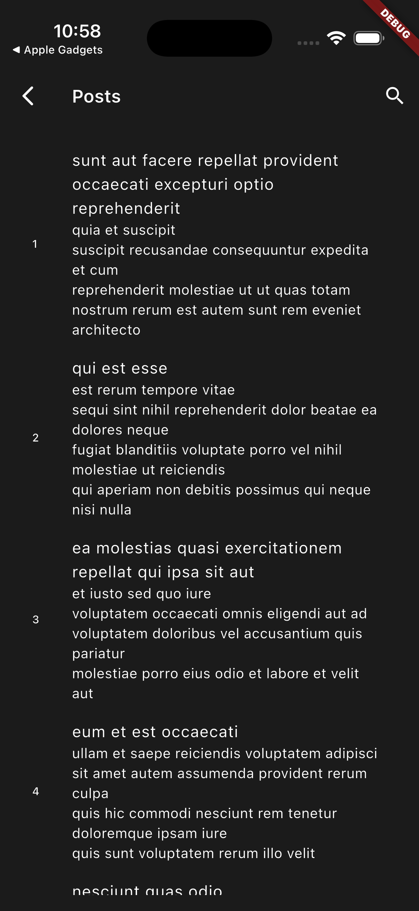

# Flutter BLoC Template with Clean Architecture

A production-ready Flutter template project implementing Clean Architecture principles with BLoC (Business Logic Component) pattern for state management. This template provides a solid foundation for building scalable and maintainable Flutter applications.

## 📖 About

This project is a comprehensive Flutter template that demonstrates the implementation of Clean Architecture and the BLoC pattern in a real-world application context. It's designed to serve as a starting point for developers who want to build robust, scalable, and maintainable Flutter applications.

The template emphasizes several key architectural principles:

1. **Clean Architecture**: The project strictly follows Clean Architecture principles, separating concerns into distinct layers (Presentation, Domain, and Data) to ensure code maintainability and testability.

2. **BLoC Pattern**: State management is implemented using the BLoC (Business Logic Component) pattern, providing a predictable state management solution that separates business logic from the UI.

3. **Dependency Injection**: The template uses GetIt for dependency injection, making the codebase more modular and easier to test.

4. **Theme Management**: Includes a robust theme management system with support for light and dark themes, demonstrating how to handle app-wide state changes.

This template is particularly useful for:

- Teams working on medium to large-scale Flutter applications
- Developers who want to learn Clean Architecture implementation in Flutter
- Projects requiring a solid foundation with best practices already in place
- Applications that need robust state management and theme handling

## 🌟 Features

- Clean Architecture implementation
- BLoC pattern for state management
- Theme management with persistent storage
- Dependency injection using GetIt
- Structured project layout
- Cross-platform support (iOS, Android, Web, macOS, Linux, Windows)
- Secure token management system
- Automatic token refresh mechanism
- Authentication state handling
- Cross-platform support (iOS, Android, Web, macOS, Linux, Windows)
- Secure token management system
- Automatic token refresh mechanism
- Authentication state handling

## 🔐 Authentication & Token Management

The template includes a robust authentication system with secure token handling and refresh flows. Key points:

### Token Management

- Access token and refresh token support
- Token storage abstraction (implementations can use secure/encrypted storage)
- Token rotation and secure removal on logout

### Authentication Flow

- Handles 401 responses by attempting a silent refresh using a refresh token
- Provides an `onTokenRefresh` callback hook used by the network layer to retry failed requests after refresh
- Session management with optional automatic logout on irrecoverable auth failures

### Implementation Details

- `TokenManager` + `TokenInterceptor` integrated in `DioNetworkServiceImpl`
- `onTokenRefresh` callback is supported to coordinate refresh logic from the DI layer
- Concurrent-request handling: requests wait for an ongoing refresh to complete to avoid multiple refresh calls
- Storage and rotation are implemented in a modular way so you can replace the storage backend (e.g., secure storage)

## 📰 Posts feature

This template includes a ready-to-use "Posts" feature that demonstrates:

- Loading paginated data from a public API (JSONPlaceholder)
- Local search across the currently loaded posts
- Pull-to-refresh and infinite scrolling (load more when user reaches near bottom)
- Proper error handling and user-friendly retry UI

Implementation highlights:

- Endpoint: `GET https://jsonplaceholder.typicode.com/posts` (configured at `lib/core/utility/api_endpoints.dart`)
- Pagination: query params `_page` and `_limit` (the `PostBloc` uses `_limit = 10` and manages `_page`)
- UI: `PostScreen` (route: `Routes.postsScreen` — `/posts`) includes a search bar, `RefreshIndicator`, and a `ListView` with infinite scroll
- Searching: search happens locally on the loaded posts (no extra network calls) and is handled by the bloc's `_filterPosts` method
- Screenshot: `screenshots/post_list_screen.png` shows the posts list UI

## 🌐 Networking & Dio error handling

Networking is implemented with Dio and a small service layer (`DioNetworkServiceImpl`) that:

- Wraps Dio calls and returns a typed `Either<CustomError, Response>` to the domain layer
- Adds `TokenInterceptor` when a `TokenManager` is provided to automatically inject auth headers and handle token refresh
- Provides `onTokenRefresh` callback support so DI layer code can perform refresh and tell the network service to retry

Error handling:

- Centralized in `lib/core/base/error/error_handler.dart`
- Translates `DioException` types into a `CustomError` with friendly messages and an `ErrorType` (timeout, network, server, unauthorized, notFound, etc.)
- Handles connection errors, timeouts, HTTP status codes (400/401/403/404/5xx), and unknown errors
- The repository and usecase layers return these errors up to blocs, which show friendly UI and retry options

## 🖼️ Screenshots

<p align="center">
   
</p>

- `screenshots/post_list_screen.png` — shows the Posts list screen with search, pull-to-refresh, and infinite scroll.

## 🏗️ Project Structure

```
lib/
├── core/                   # Core functionality
│   ├── base/              # Base classes and interfaces
│   ├── constants/         # Application constants
│   ├── di/                # Dependency injection setup
│   ├── extensions/        # Extension methods
│   ├── localization/      # Internationalization
│   └── logger/            # Logging functionality
│
├── data/                  # Data layer
│   ├── datasources/       # Data sources implementations
│   └── service/          # API services and local storage
│
├── domain/               # Domain layer (Business logic)
│   ├── entities/         # Business objects
│   ├── repositories/     # Repository interfaces
│   └── usecases/        # Use cases
│
└── presentation/        # Presentation layer
    ├── core/            # Core UI components
    │   └── theme/       # Theme management
    └── features/        # Feature-specific UI components
```

## 🔧 Dependencies

- Flutter SDK: ^3.9.2
- flutter_bloc: ^9.1.1
- get_it: ^9.0.5
- equatable: ^2.0.7
- shared_preferences: ^2.5.3

## 🚀 Getting Started

### Prerequisites

- Flutter SDK (^3.9.2)
- Dart SDK (^3.9.2)
- IDE (VS Code, Android Studio, or IntelliJ)

### Installation

1. Clone the repository:

```bash
git clone https://github.com/HijbullahMahmud/flutter_bloc_template_with_clean_architecture.git
```

2. Navigate to the project directory:

```bash
cd flutter_bloc_template_with_clean_architecture
```

3. Install dependencies:

```bash
flutter pub get
```

4. Run the app:

```bash
flutter run
```

## 🏛️ Architecture

This template follows Clean Architecture principles, dividing the application into three main layers:

### 1. Data Layer

- Handles data operations
- Implements repositories
- Manages API calls and local storage
- Contains data models and mapping logic

### 2. Domain Layer

- Contains business logic
- Defines entities
- Declares repository interfaces
- Implements use cases

### 3. Presentation Layer

- Manages UI components
- Implements BLoC pattern
- Handles state management
- Contains screens and widgets

## 🎨 Theme Management

The template includes a robust theme management system with:

- Light and dark theme support
- Persistent theme storage
- Easy theme switching
- Customizable theme components

## 💉 Dependency Injection

Dependency injection is implemented using GetIt, providing:

- Clean separation of concerns
- Easy testing capabilities
- Modular code structure
- Simplified dependency management

## 📝 Usage

1. **Adding a New Feature**

   - Create feature folder in `lib/presentation/features`
   - Add necessary BLoCs, screens, and widgets
   - Register dependencies in `lib/core/di`

2. **Theme Customization**

   - Modify `lib/presentation/core/theme/theme.dart`
   - Update theme states in theme management

3. **Adding Dependencies**
   - Register in `lib/core/di/dependency_injection.dart`
   - Follow the established pattern for each layer

## 🧪 Testing

The project includes support for:

- Unit tests
- Widget tests
- Integration tests

Run tests using:

```bash
flutter test
```

## 📱 Supported Platforms

- iOS
- Android
- Web
- macOS
- Linux
- Windows

## 🤝 Contributing

Contributions are welcome! Please feel free to submit a Pull Request.

## 📄 License

This project is licensed under the MIT License - see the LICENSE file for details.

## 👨‍💻 Author

HijbullahMahmud

---

⭐ Star this repository if you find it helpful!
